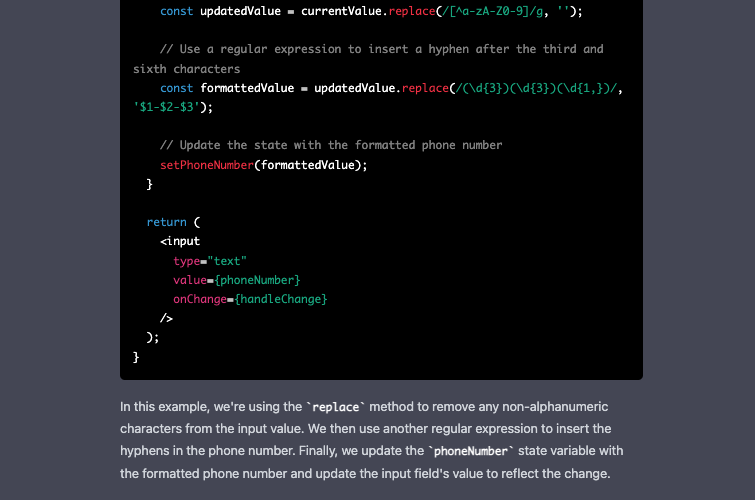
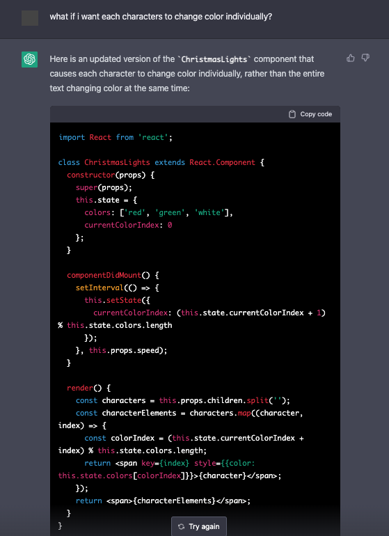

react-ui-components
===============

This is a collection of `React` `components` and `custom hooks` that are based from generated code using `OpenAI` [ChatGPT](https://openai.com/blog/chatgpt/) to demonstrate how a developer could take advantage and benefit from it to make their work more productive by helping them build things.

# Development

This React project is bootstrapped using [Create React App](https://create-react-app.dev/) since I am using [Storybook](https://storybook.js.org/docs/react/get-started/install) to develop the components.

# UI Components

These are the list of components and the screenshots of prompts and exchanges used to generate them from `ChatGPT`. The code might have been updated and modified to make it work.

Use `Storybook` to check the components.

## PhoneInput





## ChristmasText





## Marquee


## BeepButton


As for the last prompt, the unfinished response was removed when the network error occurred. I tried it again and was able to copy the code generated before the network error occurred again.

# Custom Hooks

These are the list of custom hooks and the screenshots of prompts and exchanges used to generate them from `ChatGPT`. The code might have been updated and modified to make it work.

## useElementWidth


# Setup

Clone the repository, install the dependencies and run

```sh
$ git clone https://github.com/supershaneski/react-ui-components.git myproject

$ cd myproject

$ npm install

$ npm start
```

Open your browser to `http://localhost:3000/` or some other port depending on the availability.

To run `Storybook`

```sh
$ npm run storybook
```

Your browser should automatically open to `http://localhost:6006`.
